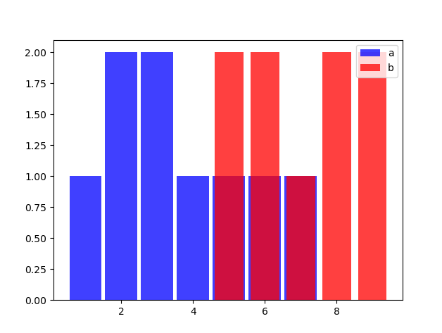
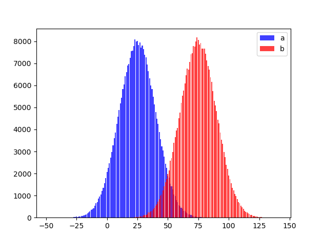
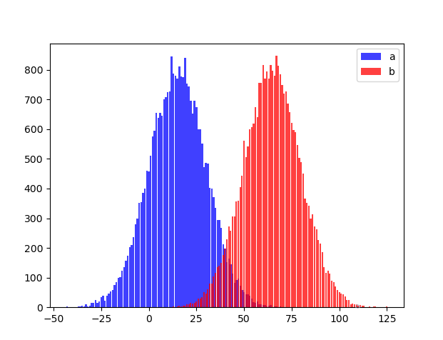
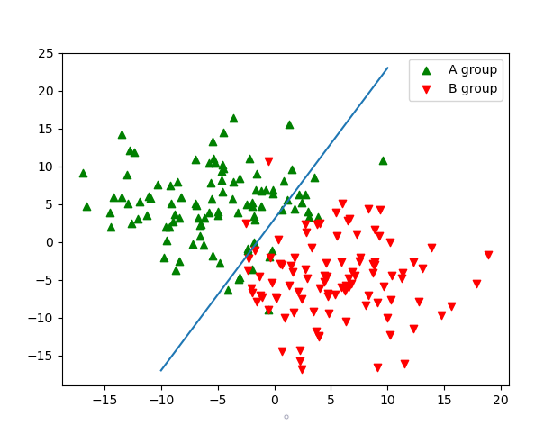

# Báo cáo thực hành Tuần 1
* Họ và tên: Đinh Hoàng Hải Đăng
* MSSV: 17100261
* Nhóm thực hành: 2 (Thứ 4 / Tiết 10-12)

## Bài 1
#### Các hàm sử dụng:
* Tìm Thread Hold:
```py
def find_TH(arr1, arr2):
  arr1 = np.sort(arr1)
  arr2 = np.sort(arr2)
  glo_correct = -1
  threadHold = -1
  min_val = min(np.amin(arr1), np.amin(arr2))
  max_val = max(np.amax(arr1), np.amax(arr2))
  i_1, i_2 = (0, 0)
  for val in range(min_val-1, max_val+2):
    while i_1 < len(arr1) and val > arr1[i_1]:
      i_1 += 1
    while i_2 < len(arr2) and val > arr2[i_2]:
      i_2 += 1
    correct = len(arr1[:i_1]) + len(arr2[i_2:])
    if correct > glo_correct:
      glo_correct = correct
      threadHold = val
  return threadHold 
```
* Phân lớp:
```py
def classification(arr1, arr2, threadHold):
  arr1 = np.sort(arr1)
  arr2 = np.sort(arr2)
  i_1, i_2 = (0, 0)
  while arr1[i_1] < threadHold:
    i_1 += 1
  while arr2[i_2] <= threadHold:
    i_2 += 1
  return (arr1[:i_1], arr2[i_2:])
```
* Vẽ histogram:
```py
def draw_hist(arr1, arr2):
  nw_arr1 = Counter(arr1).items()
  nw_arr2 = Counter(arr2).items()
  X,Y = zip(*nw_arr1)
  X2,Y2 = zip(*nw_arr2)
  bar_width = 0.9
  plt.bar(X,Y,bar_width,color="blue",alpha=0.75,label="a")
  bar_width = 0.8
  plt.bar(X2,Y2,bar_width,color="red",alpha=0.75,label="b")
  plt.legend(loc='upper right')
  plt.show()
```
##### a. Thực hiện phân tách điểm trên tập cho trước
Ta đặt hai mảng cho trước a và b:
`a = np.array([1,2,3,2,3,4,5,6,7])`
`b = np.array([5,5,6,6,7,8,9,9,8])`
Kết quả:

*Tìm được ThreadHold = 5*

##### b. Thực hiện phân tách điểm trên tập ngẫu nhiên
Ta sinh hai mảng a, b ngẫu nhiên:
`a = np.random.normal(25, 15, size=300000).round(0).astype(np.int)`
`b = np.random.normal(75, 15, size=300000).round(0).astype(np.int)`
Trong đó:
* mảng `a` có mean = 25, sigma = 15 và có tổng cộng 300000 (được làm tròn lại thành số nguyên)
* mảng `b` có mean = 75, sigma = 15 và có tổng cộng 300000 (được làm tròn lại thành số nguyên)
Kết quả:

*Tìm được ThreadHold = 50*

##### c. Thực hiện phân tách điểm trên tập được đọc từ file
Ta lưu và đọc hai mảng `a` và `b` vào từ file `inp.csv` như sau:
```py
a = np.random.normal(15, 15, size=30000).round(0).astype(np.int)
b = np.random.normal(65, 15, size=30000).round(0).astype(np.int)
file = "inp.csv"

# Write to file
print("Writing to file:", file)
content = np.vstack((a, b))
df = pd.DataFrame(content)
df.to_csv(file,  na_rep="NAN!")

# Read from file
print("Reading from file:", file)
df = pd.read_csv(file)
a = np.array(df.iloc[0])
b = np.array(df.iloc[1])
```
Thực hiện việc phân tách ta được kết quả như sau:

*Tìm được ThreadHold = 40*

## Bài 2. Thực hiện phân tách trên một mặt phẳng hai chiều
Ta sinh ra ngẫu nhiên hai nhóm trên mặt phẳng tọa độ, đặt tên là `A group` và `B group`:
```py
# A group
x = np.random.normal(-5, 5, size=100)
y = np.random.normal(5, 5, size=100)
plt.scatter(x, y, c='g', marker='^', label="A group")
groupA = np.array([(i, j) for i, j in zip(x, y)])

# B group
x = np.random.normal(5, 5, size=100)
y = np.random.normal(-5, 5, size=100)
plt.scatter(x, y, c='r', marker='v', label="B group")
groupB = np.array([(i, j) for i, j in zip(x, y)])
```
Ta đoán một đường thẳng là điểm cắt của hai nhóm này, có phương trình là `y = 2x + 3`:
```py
# Guess line
x = np.linspace(-10, 10)
y = 2*x + 3
plt.plot(x, y)
```
Kết quả:

