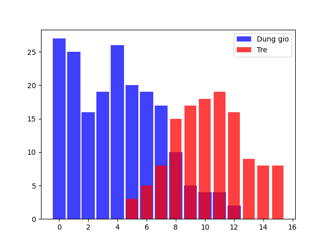
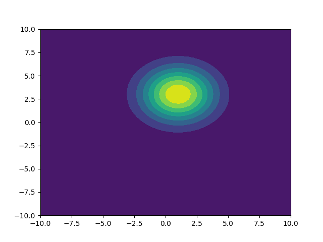

# Báo cáo thực hành Tuần 2
* Họ và tên: Đinh Hoàng Hải Đăng
* MSSV: 17100261
* Nhóm thực hành: 2 (Thứ 4 / Tiết 10-12)

---

## Bài 1
* Phương trình phân lớp: (Hàm trả về tỉ lệ phần trăm đi trễ tại một thời gian input) 
```py
def check_prob_late(min):
    s = in_time_dict.get(min,0)
    if s == 0:
        return 0
    else:
        m = too_late_dict.get(min,0)
        return s/(s+m)
```
Sử dụng hàm ở trên ta tìm khoảng thời gian quyết định chủ yếu việc đi trễ (>50%)
```py
# find threadHold
min = 101
threadHole = -1
for minute in range(16):
    prob = check_prob_late(minute)
    if abs(prob-0.5) < min:
        min = abs(prob-0.5)
        threadHole = minute
```
* Tỉ lệ đi trễ nếu rời nhà lúc `6:34`, `6:35`, `6:36`, `6:37`, `6:38`:  
 

---

## Bài 2
* Lớp xử lý đặc trưng:
```py
class Feature:
  def __init__(self, data, name=None, bin_w=None):
    self.name = name
    self.bin_w = bin_w
    if bin_w:
      self.min, self.max = min(data), max(data)
      bins = np.arange((self.min // bin_w) * bin_w,
                       (self.max // bin_w) * bin_w,
                       bin_w)
      self.freq_dict = dict(zip(*np.histogram(data, bins)[::-1]))
    else:
      self.freq_dict = Counter(data)
    self.freq_sum = sum(self.freq_dict.values())

  def get_freq(self, value):
    # P(x)
    if self.bin_w:
      value = (value // self.bin_w) * self.bin_w
    return self.freq_dict.get(value, 0)
```

* Lớp tính độ tương quan (likelyhood):
```py
class NaiveBayes:
  def __init__(self, name, *features):
    self.features = features
    self.name = name

  def prob_value_giving_feature(self, *feature_value):
    '''
    can be know as giving a feature how probability that value is in the giving feature
    P(x | wi)
    '''
    result = 1
    for f, fv in zip(self.features, feature_value):
      if f.freq_sum == 0:
        return 0
      else:
        result *= f.get_freq(fv) / f.freq_sum
    return result
```

* Hàm phân lớp:
```py
class Classifier:
  def __init__(self, *nbClass):
    self.nbClass = nbClass

  def prob_feature_giving_value(self, data, best_only=True):
    # P(wi | x)
    prob_list = list()
    for nbc in self.nbClass:
      prob_list.append( (nbc.prob_value_giving_feature(*data), nbc.name) )
    prob_sum = sum( [v[0] for v in prob_list] )
    if prob_sum == 0:
      # In case of not found
      # Distribute evenly between every class
      # This make sure the final result <= 1
      number_class = len(self.nbClass)
      prob_list = [ (1/number_class, name) for _, name in prob_list ]
    else:
      prob_list = [ (value/prob_sum, name) for value, name in prob_list ]

    if best_only:
      return max(prob_list)
    else:
      return prob_list
```

* Kết quả thu được:
```
Sử dụng đặc trưng chiều cao:
(140,) (0.5, 'male')
(200,) (1.0, 'male')
(153,) (1.0, 'female')
(188,) (1.0, 'male')
(159,) (0.875, 'female')
(160,) (0.6153846153846154, 'female')
(180,) (0.5555555555555556, 'male')
(150,) (1.0, 'female')
(170,) (0.5384615384615385, 'female')

Sử dụng đặc trưng tên:
('Edgar',) (0.5, 'male')
('Benjamin',) (1.0, 'male')
('Fred',) (1.0, 'male')
('Albert',) (1.0, 'male')
('Laura',) (1.0, 'female')
('Maria',) (1.0, 'female')
('Paula',) (1.0, 'female')
('Sharon',) (1.0, 'female')
('Jessie',) (0.6666666666666667, 'female')

Sử dụng đặc trưng tên + chiều cao:
('Maria', 140) (0.5, 'male')
('Anthony', 200) (1.0, 'male')
('Anthony', 153) (0.5, 'male')
('Jessie', 188) (1.0, 'male')
('Jessie', 159) (0.9333333333333333, 'female')
('Jessie', 160) (0.761904761904762, 'female')
```

* Nhận xét: Ta thấy rằng nếu chỉ dựa vào tên thì `Jessie` không được chia rõ ràng, khi ta kết hợp với đặc trưng chiều cao thì nếu `Jessie` cao `188cm` thì đảm bảo người ấy là `male`, còn nếu càng thấp thì khả năng thành `female` càng cao.

---

## Bài 3
* Hàm tính mean:
```py
def mean(arr):
    if len(arr.shape) == 1:
        return sum(arr)/len(arr)
    return sum(mean(xi) for xi in arr)/len(arr)
```

* Hàm tính var:
```py
def var(arr):
    m = mean(arr)
    return sum((xi - m)**2 for xi in arr)/len(arr)
```
* Kết quả:  
 

---

## Bài 4
* Hàm tính mean:
```py
def mean(arr):
  if len(arr.shape) == 1:
    return sum(arr)/len(arr)
  return sum(mean(xi) for xi in arr)/len(arr)
```

* Hàm tính cov:
```py
def cov(dataset):
  row, col = dataset.shape
  mean_ar = list()
  matrix_result = list()
  for r in range(row):
    mean_ar.append(mean(dataset[r]))
  for r1 in range(row):
    for r2 in range(row):
      result = 0
      for c in range(col):
        result += (dataset[r1][c] - mean_ar[r1])*(dataset[r2][c] - mean_ar[r2])
      matrix_result.append(result/(col-1))
  return np.array([matrix_result]).reshape(row, row)
```

* Kết quả:  
 

---

## Bài 5-6
* Plot kết quả:  
 
* Nhận xét: Hàm phân phối chuẩn của câu 6 hội tụ hơn của câu 5, hai hàm mật độ này giao nhau ở (3.75, 0.15)

---

## Bài 7
* Plot kết quả (với 3 điểm đỏ tương ướng với các điểm `[0 0]`, `[3 4]`, và `[1 2]`:

* Khoảng cách Mahalanobis:
```
Mahalanobis distance:
[[3.00457555 0.62112092 1.49059994]
 [3.61261148 1.46249739 2.06424028]
 [1.34324352 2.42770063 0.91678538]
 [1.29456559 2.46126083 0.90746535]
 [1.66081174 2.48665952 0.74528775]
 [2.21084808 2.05412458 0.89099893]
 [2.85849621 0.812946   1.25597243]
 [1.99239299 3.32038678 1.69383425]
 [2.515939   1.8951884  1.11979934]
 [2.44663813 1.34090819 0.83455611]
 [2.2729228  3.25997646 1.79921411]
 [4.02308408 0.91445625 2.61562287]
 [2.51070354 1.32130413 0.90256961]
 [1.60231268 2.03350861 0.04774629]
 [3.03591539 0.78272342 1.42098496]
 [2.59324146 1.00620813 1.03976986]
 [1.64577781 2.83251979 1.08752195]
 [3.9263172  0.96803622 2.31391308]
 [1.74842565 1.94925121 0.1612879 ]
 [2.32029463 2.13223987 1.05529177]
 [1.67803162 1.96508336 0.07058076]
 [0.63401059 3.26181002 1.22726597]
 [2.62340526 1.32690106 1.02942415]
 [2.12025314 2.23695123 0.9321168 ]
 [3.09968305 3.17379121 2.26703213]
 [1.49845879 2.26109488 0.29262164]
 [3.3868615  2.44937384 2.14467148]
 [4.27981693 0.74779656 2.75573217]
 [2.58354294 1.6002744  1.06449409]
 [4.20867022 1.17999287 2.59884583]
 [2.25791468 1.51945004 0.65226383]
 [2.74038849 1.14663906 1.44394583]
 [4.03076531 0.45725078 2.44563742]
 [3.09678968 3.15526729 2.25513008]
 [3.7657253  1.35253007 2.19276275]
 [2.53185638 1.80124009 1.09158824]
 [1.6869087  2.77658347 1.0587273 ]
 [0.78033888 3.57853129 1.83434294]
 [2.49544139 3.7832747  2.28510229]
 [2.24946595 1.47561932 0.99019012]
 [2.70187695 3.57118574 2.25340841]
 [3.3367751  1.90962551 1.91300186]
 [1.55033796 3.07033088 1.2638441 ]
 [3.46752005 1.59565449 1.95282526]
 [3.26475987 2.23743837 1.96079294]
 [3.1841877  0.96341107 1.86488498]
 [1.64213159 2.06899149 0.14470095]
 [2.85403658 0.76037844 1.34040852]
 [3.61735143 0.57945135 2.17270686]
 [2.16116395 3.58470621 1.97942606]
 [2.45132179 1.81193905 1.54917327]
 [2.32710028 1.95262425 0.95091544]
 [4.04629237 1.22850864 2.44637806]
 [3.6942917  1.17253744 2.41978506]
 [2.31181926 2.08146936 1.01444462]
 [4.13262045 0.54620655 2.57975982]
 [2.07632115 1.6213486  0.85514421]
 [3.14437628 0.5235468  1.54944968]
 [2.4473109  1.17533661 0.8596986 ]
 [2.84026443 0.91382458 1.22597401]
 [1.63276408 1.96970595 0.22263094]
 [2.41663631 1.7036132  0.91845274]
 [3.79056616 0.34887146 2.27409797]
 [2.83126192 0.79344056 1.24517842]
 [1.50273372 2.2375345  0.25706329]
 [1.6491482  4.28142624 2.3495831 ]
 [1.76531252 2.22804435 0.55393321]
 [2.67076914 1.24906893 1.06760791]
 [3.07386527 0.5244169  1.52119407]
 [2.25438151 1.48851568 0.64164029]
 [3.44898595 1.63604797 1.94436285]
 [2.84907843 0.74912378 1.30194666]
 [1.86227202 2.30425568 0.73699337]
 [2.28832075 1.47105787 0.67727428]
 [2.10440928 2.55152326 1.77446156]
 [2.63467    1.99267483 1.28676177]
 [1.69556053 2.09576341 0.28699073]
 [4.47113939 1.71635159 2.89543901]
 [4.75322705 3.59050971 3.60998682]
 [3.53107787 1.96881215 2.10535123]
 [3.71922021 0.36356643 2.11658182]
 [2.13595646 1.99790509 0.76768422]
 [2.08550843 3.69774107 2.57012325]
 [0.58461963 3.02721564 1.03150959]
 [2.21096951 1.39919493 0.76606781]
 [1.6471384  2.56522789 0.81940379]
 [3.68575547 0.12214153 2.13450082]
 [2.85086822 1.48435636 1.31579707]
 [2.57735085 2.20666025 1.3421002 ]
 [2.94660908 0.97062092 1.33216589]
 [1.3210285  3.49704599 2.01347497]
 [0.87975853 3.09467268 1.40242954]
 [2.69956591 1.91498682 1.31478299]
 [3.03205307 2.42244439 1.84124704]
 [2.01946862 1.64534842 0.40478197]
 [2.2114353  2.28458705 1.05414907]
 [1.71776173 2.10146395 0.33004331]
 [2.32170753 1.61632562 0.76581867]
 [2.8128252  1.82706223 1.390419  ]
 [4.74006979 1.64117446 3.13510058]
 [0.89978887 2.81500619 0.78090215]
 [3.10751671 0.82153377 1.49148636]
 [2.77220392 1.91063374 1.38413359]
 [2.53032756 2.42579656 1.42532254]
 [4.25058145 0.65252394 2.68076378]
 [3.87720546 1.592452   2.33411299]
 [2.29115029 1.58130629 0.71359941]
 [3.58739971 2.13709467 2.20472923]
 [4.02230983 1.09546358 2.41384979]
 [2.52021398 1.63593352 1.00736986]
 [2.53720094 2.43474806 1.43636374]
 [1.74768864 3.07933992 1.36917254]
 [2.96168952 2.30785363 1.73015176]
 [0.60182402 3.63609228 1.60197226]
 [3.04831406 2.85245608 2.06216976]
 [0.9427547  2.67360401 0.80586074]
 [2.2289637  1.45803276 0.9266242 ]
 [3.58662704 0.08697469 2.03712157]
 [2.54558576 1.13165785 0.93579496]
 [3.34496971 2.31967214 2.06001083]
 [2.07819693 2.33379008 0.96824516]
 [1.54511743 2.16074002 0.75119421]
 [1.16867513 3.2562712  1.30326733]
 [2.42798068 2.76530434 1.5577087 ]
 [0.80924798 2.95694543 1.18254118]
 [2.51512865 2.54204832 1.48268566]
 [4.36960721 2.80027013 3.05320236]
 [1.44405399 3.55208095 1.66452304]
 [2.28160217 1.65442509 1.22546906]
 [2.93419497 2.53676783 1.81567501]
 [1.8912446  3.32409498 1.64694775]
 [3.39614534 0.56394022 1.95023422]
 [2.14643484 1.6644192  0.56397795]
 [3.14553922 3.44907159 2.44752024]
 [1.89219829 1.76555564 0.69320201]
 [2.38492187 1.68405348 1.38008882]
 [3.60788409 0.64207693 1.99201585]
 [1.44811901 2.94379079 1.09259947]
 [2.61549512 0.9829573  1.08024577]
 [2.26728501 1.41239885 0.65296299]
 [3.30258261 2.1347245  1.95614596]
 [2.3473556  1.30982935 0.73964305]
 [2.29467016 1.37377846 0.94364283]
 [2.57067521 1.16427693 0.95482301]
 [1.914949   1.744094   0.70555885]
 [3.05976193 2.86781166 2.07844603]
 [2.12679301 1.48164441 0.69407121]
 [4.16349672 0.8238074  2.54911188]
 [1.16745271 2.90815542 0.93818209]
 [3.56339069 1.08289679 1.96587827]
 [3.53442893 0.96741702 1.92795624]
 [1.40999599 3.17970979 1.30825647]
 [1.30829512 2.61896473 0.65918684]
 [0.29931543 3.8302569  1.88201149]
 [2.82629604 1.43604106 1.70996838]
 [3.54127383 2.89199872 2.44786489]
 [2.88791404 0.71430591 1.35352753]
 [2.18887385 3.56316639 1.97672258]
 [2.72849978 3.08672792 1.96759836]
 [3.51318546 1.52580683 1.98158756]
 [3.46517961 0.99285887 1.86091384]
 [3.44756999 2.64294685 2.27110021]
 [2.87769272 1.38351921 1.31866256]
 [3.58970396 3.30076276 2.66714361]
 [2.47905268 1.6922223  0.98450506]
 [3.26246456 1.1052667  1.66833614]
 [2.04028595 1.92263998 0.59207243]
 [1.23370987 2.41346034 0.38640988]
 [2.56647523 1.04527199 1.07416523]
 [4.33395347 0.77385424 2.73962627]
 [3.53566035 0.70373554 1.91961193]
 [4.87573142 2.46014634 3.37747542]
 [3.33146023 0.47603165 1.7246419 ]
 [1.90392108 1.91598974 0.39288615]
 [2.67266411 1.34882895 1.0888828 ]
 [2.04610727 2.22332105 0.8477322 ]
 [2.53918655 2.07451536 1.23537393]
 [2.81408688 1.1135968  1.20439575]
 [2.14935071 1.58597322 0.53885703]
 [2.73659922 2.2560172  1.51036185]
 [3.64069711 0.77191014 2.02532419]
 [2.90656457 1.76579222 1.46047502]
 [2.26864513 1.63153574 0.70652524]
 [1.79952249 2.18061417 0.53920662]
 [3.14720345 1.09127651 1.54943306]
 [4.09139386 1.33959821 2.4995018 ]
 [3.18276242 2.25718904 1.89805993]
 [2.70635996 3.24581137 2.05056291]
 [2.99651041 2.81530553 2.0047137 ]
 [1.51964805 2.14297774 0.10921996]
 [1.81785126 1.91131915 0.24571774]
 [1.53794647 2.07376678 0.4652373 ]
 [1.17873828 4.51025421 2.47779316]
 [4.18696205 2.32633346 2.76828568]
 [3.37492206 2.21914904 2.04868251]
 [2.39736964 2.41388026 1.30582584]
 [1.27192289 2.32733494 0.41067154]
 [2.95850037 2.10959911 2.19594812]
 [3.25243528 2.8470245  2.21114475]
 [2.98829488 2.6910422  1.93510115]
 [1.87672168 1.75763146 0.27717608]
 [3.19550403 1.4613842  1.66070712]
 [2.98054463 1.80084899 1.54473999]
 [1.66045203 2.64353712 0.91030526]
 [2.65669737 2.71704543 1.69687301]
 [2.78279084 3.0823691  2.00134242]
 [2.27747583 2.88781672 1.53601505]
 [2.62138276 1.36244102 1.03492619]
 [1.25514966 2.46249154 0.85305072]
 [2.57565865 1.19501962 0.95990229]
 [3.34882024 2.67028435 2.20508416]
 [3.1614241  0.84276638 1.54620961]
 [2.43923941 1.16109245 0.8869787 ]
 [3.72978585 0.79304833 2.11443351]
 [3.06882069 2.202724   2.3354014 ]
 [1.29546379 3.24515355 1.78857411]
 [2.39418461 1.469095   0.80105523]
 [1.74868424 2.2500037  0.56088342]
 [1.67552879 2.22887449 0.45083227]
 [0.85245617 2.76840934 0.76376746]
 [1.56939452 2.10679302 0.09059568]
 [2.60237132 1.04466166 1.00251374]
 [3.14754262 0.72211758 1.73016232]
 [3.11794179 2.32668429 1.87121793]
 [3.33517229 2.57626198 2.15431896]
 [3.01218136 1.3192351  1.44547356]
 [1.26289797 2.57125883 0.57551113]
 [1.56706696 2.71706005 0.92465571]
 [1.76910749 2.0705214  0.97596892]
 [3.64510373 2.17227356 2.26528842]
 [0.98016025 2.63792335 0.78219255]
 [4.35265857 3.89808203 3.45466627]
 [4.00328961 1.7063017  2.46954062]
 [2.78437943 1.38661928 1.21984585]
 [2.58970002 3.65533476 2.24683158]
 [0.91224522 2.76120012 0.73159144]
 [2.94583654 0.8709187  1.33006283]
 [1.91138034 2.48022404 0.94600247]
 [1.87278329 1.82256091 0.76582631]
 [3.17495409 0.77165648 1.55885475]
 [3.46924375 0.15284112 1.89512137]
 [0.62563697 3.04277615 1.0207299 ]
 [3.17611587 0.59929945 1.71610711]
 [2.11451278 2.75007748 1.32237191]
 [0.97681221 2.62544706 0.72322085]
 [3.55400775 2.75192535 2.3988299 ]
 [1.44863456 3.6707336  1.77174051]
 [2.83083899 1.83829479 1.41249472]
 [3.77221513 0.4193233  2.1668819 ]
 [2.86610487 0.77474912 1.2729774 ]]
 ```
 
 ---
 
## Bài 8
 - Thiếu hai tập dữ liệu `class1.txt` và `class2.txt`

---

## Bài 9
* Kết quả thu được:
```
*CLASS1:
Feature1:
        +Mean: 0.06218687500000001
        +Var : 0.8717452837660599

Feature2:
        +Mean: 0.05867279999999998
        +Var : 1.0685284890658253

Feature3:
        +Mean: 2.96126355
        +Var : 3.039673866930216

Feature4:
        +Mean: 0.08500643333333335
        +Var : 0.9921645930659284

Covariance giữa Feature1 với Feature2 là:
[[0.87174528 0.04184359]
 [0.04184359 1.06852849]]

Covariance giữa Feature1 với Feature3 là:
[[ 0.87174528 -0.0425842 ]
 [-0.0425842   3.03967387]]

Covariance giữa Feature1 với Feature4 là:
[[ 0.87174528 -0.07247153]
 [-0.07247153  0.99216459]]

Covariance giữa Feature2 với Feature3 là:
[[1.06852849 0.05295708]
 [0.05295708 3.03967387]]

Covariance giữa Feature2 với Feature4 là:
[[ 1.06852849 -0.07206057]
 [-0.07206057  0.99216459]]

Covariance giữa Feature3 với Feature4 là:
[[ 3.03967387 -0.03565163]
 [-0.03565163  0.99216459]]

*CLASS2:
Feature1:
        +Mean: 0.06021218181818183
        +Var : 0.8649525687273167

Feature2:
        +Mean: 0.0535757603305785
        +Var : 1.0601799186312004

Feature3:
        +Mean: -0.03323852066115702
        +Var : 1.019089111137485

Feature4:
        +Mean: -2.8515889752066115
        +Var : 3.4766801685859914

Covariance giữa Feature1 với Feature2 là:
[[0.86495257 0.04081435]
 [0.04081435 1.06017992]]

Covariance giữa Feature1 với Feature3 là:
[[ 0.86495257 -0.0217829 ]
 [-0.0217829   1.01908911]]

Covariance giữa Feature1 với Feature4 là:
[[ 0.86495257 -0.12831742]
 [-0.12831742  3.47668017]]

Covariance giữa Feature2 với Feature3 là:
[[1.06017992 0.02422017]
 [0.02422017 1.01908911]]

Covariance giữa Feature2 với Feature4 là:
[[ 1.06017992 -0.12980585]
 [-0.12980585  3.47668017]]

Covariance giữa Feature3 với Feature4 là:
[[1.01908911e+00 5.03602239e-05]
 [5.03602239e-05 3.47668017e+00]]
 ```

* Plot histogram:

