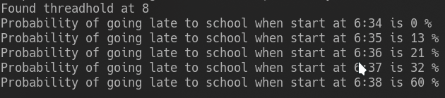
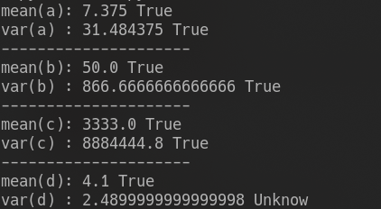
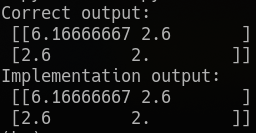

# Báo cáo thực hành Tuần 2
* Họ và tên: Đinh Hoàng Hải Đăng
* MSSV: 17100261
* Nhóm thực hành: 2 (Thứ 4 / Tiết 10-12)

---

## Bài 1
* Phương trình phân lớp: (Hàm trả về tỉ lệ phần trăm đi trễ tại một thời gian input) 
```py
def check_prob_late(min):
    s = in_time_dict.get(min,0)
    if s == 0:
        return 0
    else:
        m = too_late_dict.get(min,0)
        return s/(s+m)
```
Sử dụng hàm ở trên ta tìm khoảng thời gian quyết định chủ yếu việc đi trễ (>50%)
```py
# find threadHold
min = 101
threadHole = -1
for minute in range(16):
    prob = check_prob_late(minute)
    if abs(prob-0.5) < min:
        min = abs(prob-0.5)
        threadHole = minute
```
* Tỉ lệ đi trễ nếu rời nhà lúc `6:34`, `6:35`, `6:36`, `6:37`, `6:38`:
 

---

## Bài 3
* Hàm tính mean:
```py
def mean(arr):
    if len(arr.shape) == 1:
        return sum(arr)/len(arr)
    return sum(mean(xi) for xi in arr)/len(arr)
```

* Hàm tính var:
```py
def var(arr):
    m = mean(arr)
    return sum((xi - m)**2 for xi in arr)/len(arr)
```
* Kết quả:
 

---

## Bài 4
* Hàm tính mean:
```py
def mean(arr):
  if len(arr.shape) == 1:
    return sum(arr)/len(arr)
  return sum(mean(xi) for xi in arr)/len(arr)
```

* Hàm tính cov:
```py
def cov(dataset):
  row, col = dataset.shape
  mean_ar = list()
  matrix_result = list()
  for r in range(row):
    mean_ar.append(mean(dataset[r]))
  for r1 in range(row):
    for r2 in range(row):
      result = 0
      for c in range(col):
        result += (dataset[r1][c] - mean_ar[r1])*(dataset[r2][c] - mean_ar[r2])
      matrix_result.append(result/(col-1))
  return np.array([matrix_result]).reshape(row, row)
```

* Kết quả:
 

---

## Bài 5


