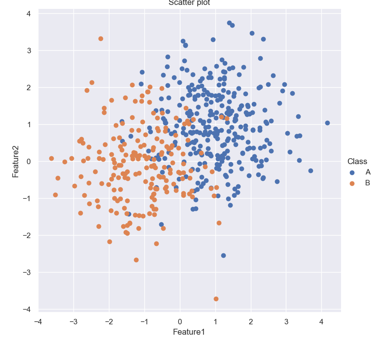
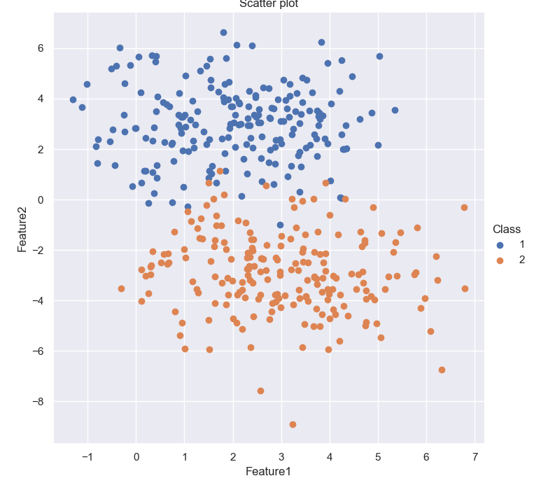
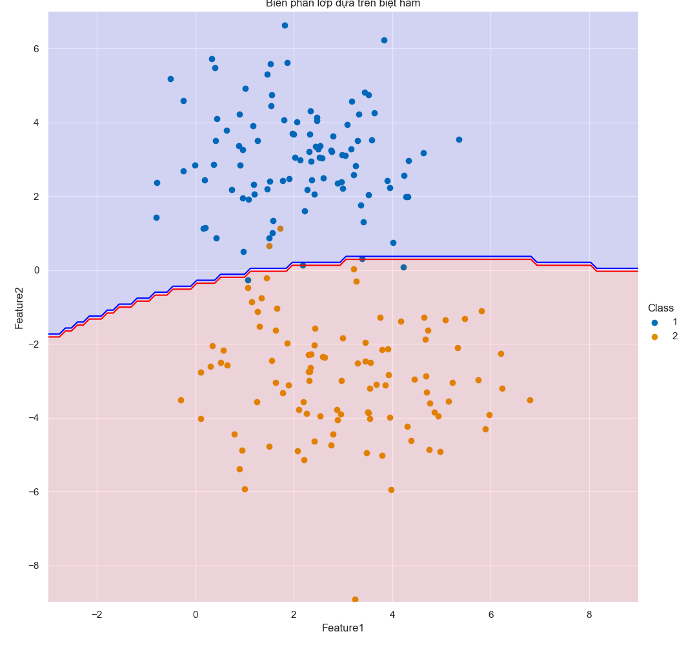

# Báo cáo thực hành Tuần 3
* Họ và tên: Đinh Hoàng Hải Đăng
* MSSV: 17100261
* Nhóm thực hành: 2 (Thứ 4 / Tiết 10-12)

---

## Bài 1
* Các đặc trưng thu thập được là dài và rộng của cánh hoa và đài hoa của 3 loại hoa (tổng cộng 150 mẫu):
```
     1_sepal_length  2_sepal_width  3_petal_length  4_petal_width    species
0               5.1            3.5             1.4            0.2     setosa
1               4.9            3.0             1.4            0.2     setosa
2               4.7            3.2             1.3            0.2     setosa
3               4.6            3.1             1.5            0.2     setosa
4               5.0            3.6             1.4            0.2     setosa
..              ...            ...             ...            ...        ...
145             6.7            3.0             5.2            2.3  virginica
146             6.3            2.5             5.0            1.9  virginica
147             6.5            3.0             5.2            2.0  virginica
148             6.2            3.4             5.4            2.3  virginica
149             5.9            3.0             5.1            1.8  virginica

[150 rows x 5 columns]
```

* Plot dữ liệu đặc trưng dài và rộng của đài hoa thuộc 3 loại hoa:  


* Plot biên phân lớp sau khi sử dụng biệt hàm:  


---

## Bài 2
* Plot tập dữ liệu:  


* Output:
```
Sỗ mẫu của Class A là: 300
Sỗ mẫu của Class B là: 195

Số lượng tập train là: 297
Số lượng tập test là: 198

Mean của từng đặc trưng trong Class A là: [0.97325173 1.03571292]
Mean của từng đặc trưng trong Class B là: [-1.06801169 -0.11463951]
```

* Implement biệt thức:
```py
def df(X, mu_list, cov_list, pi_list):
  scores_list = list()
  classes = len(mu_list)
  for p in range(classes):
    Wi = (-1/2)*np.linalg.inv(cov_list[p])
    wi = np.linalg.inv(cov_list[p])@mu_list[p]
    wi0 = (-1/2)*np.transpose(mu_list[p])@np.linalg.inv(cov_list[p])@mu_list[p] + (-1/2)*np.log(np.linalg.norm(cov_list[p])) + np.log(pi_list[p])
    score = np.transpose(X)@Wi@X + np.transpose(wi)@X + wi0
    scores_list.append(score)
  return np.argmax(scores_list)
```

* Công thức:  


#### Đánh giá:
###### Tập train chiếm 60%
* Confusion matrix:
```
         Class A Predict  Class B Predict
Class A              105               13
Class B               10               70
```

* Biên phân lớp:  


###### Tập train chiếm 70%
* Confusion matrix:
```
         Class A Predict  Class B Predict
Class A               81                4
Class B                9               55
```

* Biên phân lớp:  


###### Tập train chiếm 75%
* Confusion matrix:
```
         Class A Predict  Class B Predict
Class A               73                2
Class B               11               38
```

* Biên phân lớp:  


###### Tập train chiếm 80%
* Confusion matrix:
```
         Class A Predict  Class B Predict
Class A               59                6
Class B                7               27
```

* Biên phân lớp:  


---

## Bài 3
* Plot tập dữ liệu:   


* Thống kê tập dữ liệu:
```
Sỗ mẫu của Class 1 là: 100
Sỗ mẫu của Class 2 là: 100

Số lượng tập train là: 200
Số lượng tập test là: 200

Mean của từng đặc trưng trong Class 1 là: [1.97909027 2.97947776]
Mean của từng đặc trưng trong Class 2 là: [ 3.01056198 -2.87167377]

Cov của Class 1 là:
[[2.4802316  0.08304637]
 [0.08304637 2.44708868]]
Cov của Class 2 là:
[[ 1.89496114 -0.31990908]
 [-0.31990908  2.64843169]]
```

* Sử dụng hàm biệt thức của bài 2 ta có được Confusion matrix:
```
         Class 1 predict  Class 2 predict
Class 1               98                2
Class 2                4               96
```

* Biên phân lớp:   

